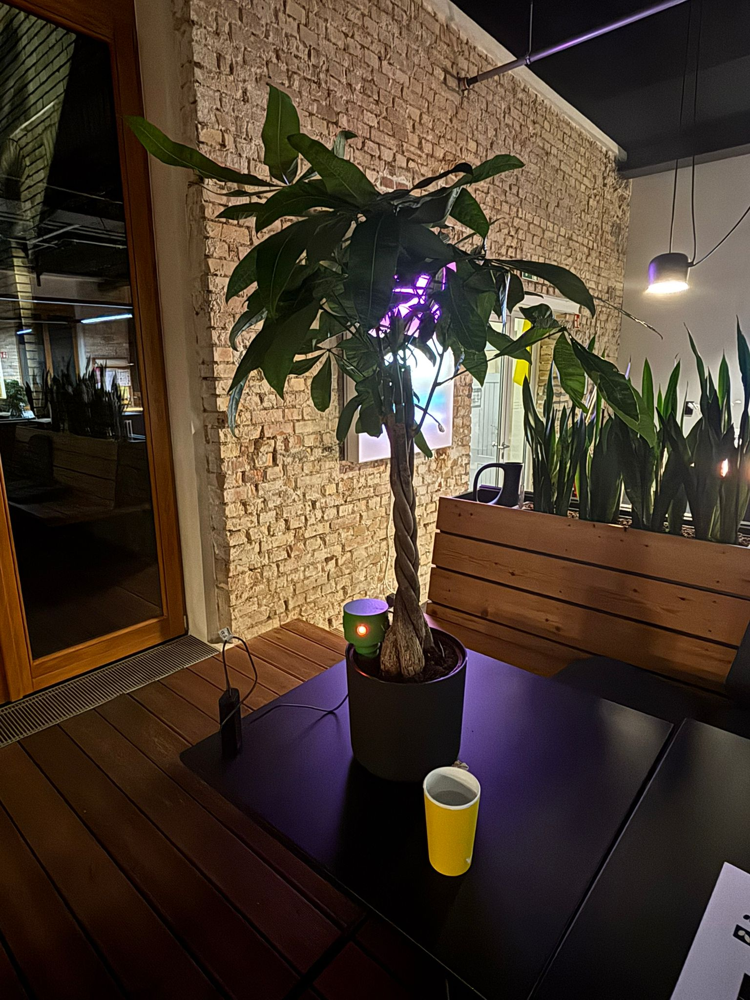

# 🌳 BeTree

### Measure where the city is dying, pay people to fix it, prove it worked.

[](https://hackxplore.de)
[](frontend)
[](backend)
[](backend/esp32)
[](#license)

**BeTree** turns a city's street trees into a connected, self-funding climate sensor grid —
and pays citizens to keep them alive. Built at **HackXplore 2026** in Karlsruhe by team **be tree**.

> A young street tree dies in its first 3–5 years without supplemental water.
> Replacing one costs the city **€5,000–15,000**. A whole summer of citizen watering
> rewards costs **under €50**. We close that gap — with real sensors, a real app, and
> sensor-verified proof that the watering actually happened.

<p align="center">
  
  <br>
  <em><strong>Sprig</strong> — our own 3D-printed sensor housing, live in a tree.
  Designed, printed, wired and flashed over the hackathon weekend with sensors
  we bought Saturday morning at a shop here in Karlsruhe.</em>
</p>

---

## This is a real product, not a slide deck

Everything below is running in this repo, today:

| Proof | Evidence |
|-------|----------|
| 🛰️ **Real hardware mesh** | ESP32 **dual-node ESP-NOW mesh** firmware ([`backend/esp32`](backend/esp32)) — low-power sensor nodes deep-sleep and relay readings to a WiFi gateway. Builds with PlatformIO. |
| 🖨️ **Self-built prototype** | We 3D-designed the **"Sprig"** enclosure ([`3d/SprigV2.step`](3d)), printed it, and stuffed it with sensors bought Saturday morning in a Karlsruhe shop. It's in a tree right now (photo above). |
| 📡 **Live sensor data** | **60,000+** real readings in the demo DB; device **KA-00001** is live. The app's watering verification polls *that real sensor*. |
| 🗺️ **The whole city, for real** | **126,434** actual Karlsruhe trees from the open tree cadastre rendered on the map — not mock pins. |
| 🧠 **A real model** | FAO-56 soil-water-balance coupled to **Open-Meteo / DWD** weather, reading **root-zone depth** (3–27 cm), so a few sensors ground-truth the whole city. |
| 📱 **Deployed app** | Mobile-first PWA at `beta.betree.me`, FastAPI at `api.betree.me`, green CI (ruff · mypy · pytest on Py 3.11–3.13). |

---

## How it works

```
  ┌─────────────┐   ESP-NOW mesh   ┌──────────────┐   HTTPS    ┌──────────────────────┐
  │ Sprig node  │ ───────────────▶ │ Gateway node │ ─────────▶ │  FastAPI backend     │
  │ soil · temp │   (deep-sleep    │ ESP-NOW↔WiFi │  /ingest   │  (VEGA)              │
  │ shock · mic │    low power)    └──────────────┘            │                      │
  └─────────────┘                                              │  SQLite ▸ readings   │
                                                               │  FAO-56 water model  │◀── Open-Meteo
        ┌──────────────────────────────────────────────────┐  │  gamification engine │     (DWD ICON-D2:
        │  Citizen PWA            City Dashboard            │  │                      │      ET₀, rain,
        │  (Next.js + MapLibre)   (health · heat · routes)  │◀─┤  REST API            │      deep soil moisture)
        └──────────────────────────────────────────────────┘  └──────────────────────┘
```

**1. Sense.** Each node measures four streams from one €24 build — capacitive **soil moisture**,
**temperature/humidity** (DHT11), **vibration** (footfall + storm tilt) and **sound**. Nodes mesh over
ESP-NOW so there's zero per-tree connectivity cost.

**2. Model the depths, not the surface.** A capacitive probe reads the top few centimetres — but a
tree drinks from 20–30 cm down. We drive a **FAO-56 soil-water-balance** with free **Open-Meteo /
DWD ICON-D2** weather (reference evapotranspiration, rainfall, and modelled **root-zone soil moisture
at 3–9 cm and 9–27 cm**). The model is *anchored* to a real sensor where one exists and *inferred from
weather physics* everywhere else. **Result: a few hundred calibration sensors ground-truth all 126k
trees.** Sparse hardware, citywide coverage.

**3. Act.** The app shows every tree coloured by thirst. A citizen finds a red tree, walks there, and
**scans the QR / taps the NFC** tag to start a watering session.

**4. Prove it ("Proof of Care").** The sensor must show a **sustained moisture rise** during the
session — cross-checked against live rainfall so you can't claim credit in a downpour. No honor system:
the soil confirms the watering. Verified waterings earn **credits → real city perks** (transit passes,
museum entry, seed packets, priority Bürgeramt slots).

**5. Pay for itself.** One saved tree (€5k–15k) outpays a full season of rewards (<€50) by **~100×** —
and the same sensor answers questions for five city departments (greenspace, planning, environment,
health, civil engineering) from one install.

---

## Repository layout

| Path | What's there |
|------|--------------|
| [`frontend/`](frontend) | Next.js 16 + React 19 PWA — map, scan/verify flow, rewards, impact, city dashboard. ([README](frontend/README.md)) |
| [`backend/`](backend) | FastAPI + SQLAlchemy (async SQLite) — sensor ingest, trees, water-balance forecast, gamification, rewards. ([README](backend/README.md)) |
| [`backend/esp32/`](backend/esp32) | **Wurzelwerk** firmware — dual-node ESP-NOW mesh (PlatformIO). Wiring in [`wiring.md`](backend/esp32/wiring.md). |
| [`3d/`](3d) | The **Sprig** sensor enclosure (`.step` CAD + photo of it deployed). |
| [`backend/PREDICTION_MODEL_PLAN.md`](backend/PREDICTION_MODEL_PLAN.md) | Full technical plan for the water-stress prediction model. |
| [`frontend/PITCH.md`](frontend/PITCH.md) | The 3-minute hackathon pitch. |
| [`docs/REPORT.md`](docs/REPORT.md) | Jury report — vision, costs, feasibility, scalability, timeline. |

---

## Quick start

**Backend** (FastAPI, Python 3.11+):

```bash
cd backend
python3 -m venv .venv && source .venv/bin/activate
pip install -e ".[dev]"
vega                      # → http://localhost:8000  (docs at /docs)
pytest                    # run the test suite
```

**Frontend** (Next.js 16, Node 20+):

```bash
cd frontend
npm install
npm run dev               # → http://localhost:3000
# point it at a backend with NEXT_PUBLIC_API_BASE_URL (defaults to http://localhost:8000)
```

**Firmware** (PlatformIO):

```bash
cd backend/esp32
pio run -e mesh_node      # low-power ESP-NOW sensor node
pio run -e full_node      # always-on WiFi↔ESP-NOW gateway
```

---

## Tech stack

**Frontend** — Next.js 16 · React 19 · TypeScript · Tailwind 4 · MapLibre GL (vector tiles) ·
Zustand · Turf.js · QR/NFC scanning · PWA.

**Backend** — FastAPI · async SQLAlchemy 2 · SQLite (→ Postgres/PostGIS) · Pydantic 2 ·
Open-Meteo weather client · ruff + mypy + pytest, GitHub Actions CI.

**Hardware** — ESP32 (WROOM) · capacitive soil moisture · DHT11 · vibration/IMU · electret mic ·
ESP-NOW mesh (LoRaWAN on the roadmap) · solar + LiPo · 3D-printed enclosure.

**Model** — FAO-56 dual-source soil-water balance · Open-Meteo / DWD ICON-D2 (2 km grid over Germany) ·
sensor-anchored calibration story.

---

## Team

**be tree** — HackXplore 2026, Karlsruhe.
*"To be tree, or not to be tree — that is the question."*

## License

MIT — see [`LICENSE`](LICENSE).
